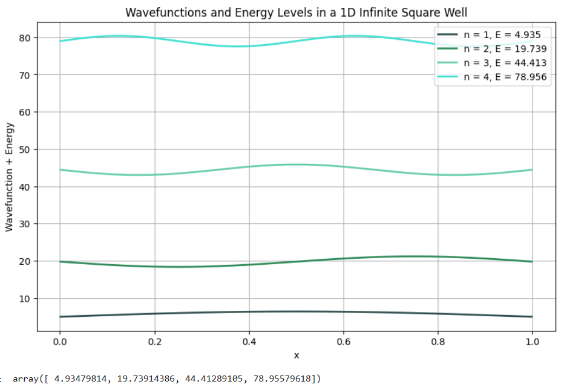
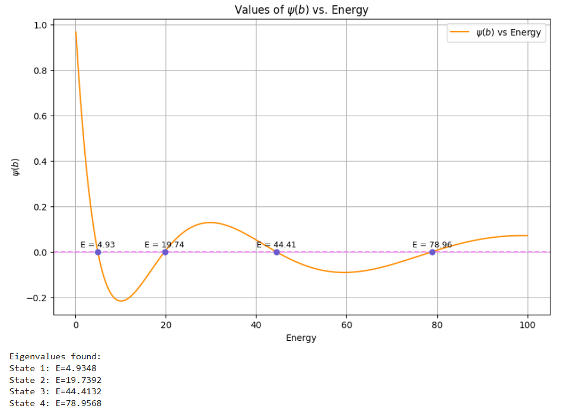

# TISE
Mini project: Solving the Time Independent Schrodinger Equation (TISE) in 1D

This project is an attempt to numerically solve the 1D TISE for a particle in a potential well using Python. 

# It includes code that:
- Implements both the **finite difference** and **shooting** methods
- Computes and visualizes **eigenfunctions** and **eigenenergies**
- Plots **wavefunctions** and **energy levels**
- 
## Finite Difference Method
- Discretizes the second derivative using a central difference approximation.
- Converts the differential equation into a matrix eigenvalue problem.
- Eigenvalues correspond to allowed energies.
- Eigenvectors correspond to wavefunctions.

## Shooting Method
- Converts the boundary value problem into an initial value problem.
- Integrates the Schrödinger equation for trial energies.
- Eigenvalues are identified when the boundary condition ψ(b)=0 is satisfied.
- Zero-crossings of ψ(b) determine allowed energies.

# Physics:
**Schrödinger Equation:**
- Time-Independent Schrödinger Equation in 1D:
      −ℏ²⁄2m · d²ψ/dx² + V(x)ψ = Eψ
  
      *In atomic units (ℏ = m = 1):*
  so
      -1/2 · d²ψ/dx² + V(x)ψ = Eψ

# Outputs
- Below are example outputs generated by the code.

**Figure 1, Shooting Method**

Figure 1. Boundary-value convergence using the shooting method. The value of the wavefunction at the boundary psi(b) is plotted as a function of trial energy. Eigenenergies correspond to the zero-crossings where psi(b) = 0, satisfying the boundary condition. The eigenvalues obtained agree with those from the finite difference method.

**Figure 2, Finite Difference Method**

Figure 2. First four normalized eigenfunctions of the 1D infinite square well computed using the finite difference method. Each wavefunction is vertically shifted by its corresponding eigenenergy for visualization. The computed energies
E₁ ≈ 4.93,
E₂ ≈ 19.74,
E₃ ≈ 44.41,
E₄ ≈ 78.96

demonstrate the expected quadratic scaling:

E_n = (n^2 * pi^2) / (2L^2)

which implies E_n is proportional to n^2.

# Disclaimer:
This project was created as a personal learning exercise based on university coursework and independent study. It is intended as a portfolio piece and a practice tool for numerical physics.

# References:
- **ChatGPT** – for code explanations and documentation structure
- **Helen Tronica’s blog** – [Quantum Mechanics with Python](https://helentronica.com/2014/09/04/quantum-mechanics-with-the-python/)
- **Class notes** – University of Waterloo

# License:
- This project is licensed under the MIT License. Feel free to use, modify, and share this work with proper attribution.
